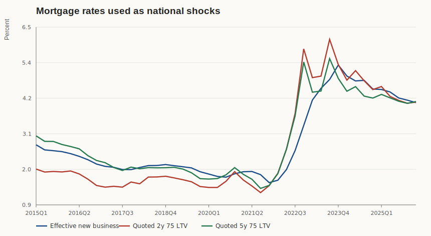
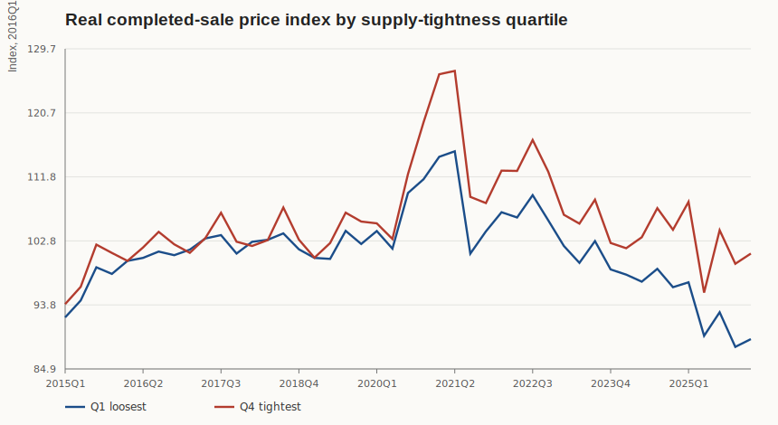
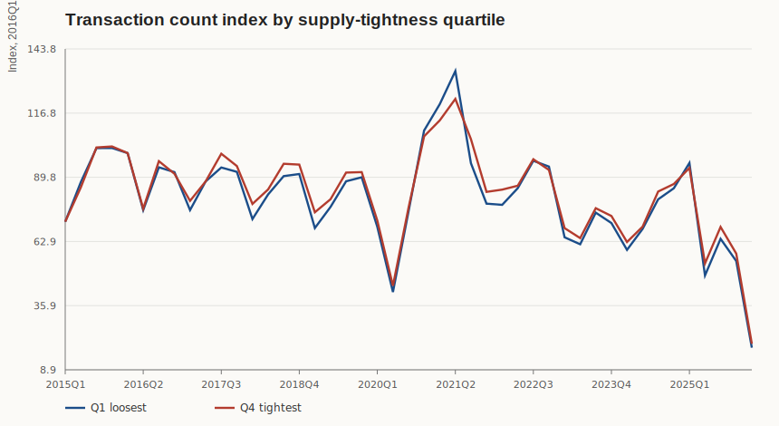
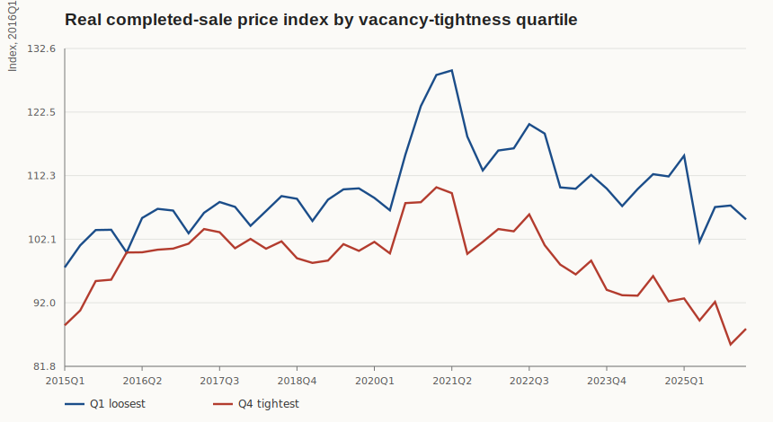

# Mortgage-Rate Pass-Through Under Supply Constraints In England

> AI disclaimer: This review draft was generated with AI assistance from Re Trends warehouse extracts and local analysis outputs updated on 2026-04-25. The analysis code, SQL, outputs, and conclusions should be independently reviewed before publication or operational use.
>
> Evidence status: This draft uses completed-sale, mortgage-rate, inflation, supply, stock/vacancy, postcode-geography, and labour-market data from the Re Trends project. Results should be treated as first-pass empirical evidence, not final causal estimates.

## Executive Summary

This draft tests whether national mortgage-rate shocks pass through more strongly to local completed-sale house prices where local housing supply and stock buffers are weak. The headline sample is an England `LAD-quarter` completed-sale panel from `2015Q1` to `2026Q1`, with post-2016 models preferred because the modern Bank of England effective-rate family is cleaner from 2016 onward. The data have been prepared enough for a review-ready screening study, but not enough for publication-grade causal claims.

The evidence is mixed and should be read as a completed-sale pass-through screen rather than a live-market timing estimate.

- `H1`, supply-constrained places have larger price responses: low-confidence directional support. The same-quarter effective-rate supply interaction is negative in the baseline (`-0.0071`, `p=0.0246`) and survives mean-log price measurement (`-0.0054`, `p=0.0302`), property-mix controls (`-0.0053`, `p=0.0191`), claimant-metric controls (`-0.0071`, `p=0.0252`), latest-quarter exclusion (`-0.0072`, `p=0.0377`), and a stricter 50-transaction threshold (`-0.0070`, `p=0.0703`). Confidence stays low because the result weakens outside London (`-0.0005`, `p=0.8788`) and is not stable across effective-rate timing choices.
- `H2`, more elastic places adjust more through quantities: inconclusive. Supply tightness does not produce a clear transaction-volume decline in the effective-rate model (`0.0013`, `p=0.9039`). Quoted-rate supply interactions are positive in several specifications, which is not a clean quantity-adjustment story.
- `H3`, low vacancy strengthens pass-through: inconclusive for prices, stronger for transaction stress. Vacancy-tightness price interactions are unstable, but vacancy-tight areas show robust transaction declines after rate increases in same-quarter and quoted-rate specifications.
- `H4`, quoted-effective spreads identify a credit-friction channel: inconclusive. Spread interactions do not explain real price responses in the baseline screening model.
- `H5`, the recent fixed-rate-reset episode has distinctive timing: low-confidence, mixed evidence. The original `2021Q4-2024Q4` episode pattern weakens when the completed-sale window is shifted forward by two quarters.

The most defensible review-stage conclusion is:

> There is first-pass evidence that realized supply-flow constraints matter for local completed-sale price pass-through, but the signal is not decision-grade because it is sensitive to geography and mortgage-rate timing. Vacancy tightness looks more reliable as a transaction-stress marker than as a price-pass-through marker.

## Hypotheses And Findings

| Hypothesis | Test | Result | Confidence | Interpretation |
| --- | --- | --- | --- | --- |
| `H1` Supply-constrained places have larger price responses | 4-quarter real price response to mortgage-rate shocks interacted with 2013-2015 supply tightness | Effective-rate beta `-0.007102`, `p=0.0246`; mean-log price beta `-0.005430`, `p=0.0302`; property-mix beta `-0.005292`, `p=0.0191`; outside-London beta `-0.000485`, `p=0.8788` | Low | Directionally supportive, but timing-sensitive and geography-sensitive. |
| `H2` Elastic places adjust more through quantities | 4-quarter transaction response to effective and quoted mortgage-rate shocks interacted with supply tightness | Effective-rate beta `0.001319`, `p=0.9039`; quoted 2-year beta `0.007957`, `p=0.0047` | Inconclusive | No clear supply-flow transaction-decline channel. |
| `H3` Low vacancy strengthens pass-through | Price and transaction responses interacted with vacancy tightness | Price beta `0.003484`, `p=0.1644`; transaction beta `-0.022902`, `p<0.0001` | Inconclusive for price; medium-low for transactions | Vacancy does not robustly explain prices, but does flag transaction stress. |
| `H4` Spread captures credit frictions | 4-quarter real price response to quoted-effective spread shock interacted with supply tightness | Spread beta `0.000230`, `p=0.8561` | Inconclusive | No clear price signal from the spread interaction. |
| `H5` Recent fixed-rate era differs | `2021Q4-2024Q4` quartile episode comparison plus shifted completion windows | Original supply-tight Q1 price `-7.49%`, Q4 price `-3.45%`; two-quarter shifted Q1 price `-15.62%`, Q4 price `-15.12%` | Low | The episode is informative but not a clean supply-flow confirmation. |

## Data Sources And Sample

The core analysis is reproducible from `queries/01_postcode_join_quality.sql` through `queries/05_labour_lad_quarter.sql` and `analysis/analyze.py`. The full intermediate extract tables are kept as local research artifacts rather than public repository artifacts; the draft reports their row counts and uses generated figures/model summaries for review.

| Prepared dataset | Rows | Use |
| --- | ---: | --- |
| Completed-sale LAD-quarter panel | 13,319 | Completed-sale price, property mix, and transaction panel |
| Quarterly mortgage-rate series | 45 | National mortgage-rate shock series |
| LAD supply, stock, and vacancy panel | 8,318 | Realized supply, stock, and vacancy proxies |
| LAD-quarter labour panel | 14,670 | Local claimant-count controls |
| Postcode join-quality audit | 26 | Yearly postcode join-quality audit |
| Latest-quarter completeness check | 10 | Completed-sale timing and latest-quarter completeness check |
| Lagged-shock model results | 108 | Same models using lagged and cumulative mortgage-rate timing |
| Robustness model results | 61 | Data-issue robustness checks |
| Data issue mitigation summary | 7 | Data issue, mitigation, and residual-risk summary |

Source references used in this draft:

| Source | Re Trends table | Role | Key caveat |
| --- | --- | --- | --- |
| [HM Land Registry Price Paid Data](https://www.gov.uk/government/statistical-data-sets/price-paid-data-downloads) | `land_registry_price_paid_transactions` | Completed-sale prices and transactions | HM Land Registry notes that recent monthly data are updated later, so latest quarters are provisional. |
| [ONS National Statistics Postcode Lookup](https://www.ons.gov.uk/methodology/geography/geographicalproducts/postcodeproducts) | `dim_postcode_geography` | Postcode-to-LAD/region bridge | Current NSPL snapshot, not point-in-time historical geography. |
| [Bank of England effective interest rates](https://www.bankofengland.co.uk/statistics/details/further-details-about-effective-interest-rates-data) | `mortgage_rates_monthly_effective` | Effective new-business mortgage rates | Paid-rate series; methodology and sample breaks matter, especially around 2016. |
| [Bank of England quoted household interest rates](https://www.bankofengland.co.uk/statistics/details/further-details-about-quoted-household-interest-rates-data) | `mortgage_rates_monthly_quoted` | Quoted 2-year and 5-year mortgage rates | Advertised product rates, not realized borrower rates. |
| [ONS Consumer price inflation time series](https://www.ons.gov.uk/economy/inflationandpriceindices/datasets/consumerpriceindices) | `inflation_monthly_core` | CPIH/CPI deflators | National deflator only; quarter fixed effects absorb most CPIH/CPI differences. |
| [GOV.UK live tables on housing supply](https://www.gov.uk/government/statistical-data-sets/live-tables-on-net-supply-of-housing) | `fact_lad_supply_year` | Net additions and completions rates | Annual realized supply, not planning pipeline or structural elasticity. |
| [GOV.UK live tables on dwelling stock](https://www.gov.uk/government/statistical-data-sets/live-tables-on-dwelling-stock-including-vacants) | `fact_lad_housing_stock_year` | Vacancy and long-term vacancy rates | Annual England-only series; stock and vacancy reference dates differ. |
| [Nomis claimant count by sex and age](https://www.nomisweb.co.uk/datasets/ucjsa) | `fact_area_labour_month` | Local labour-market controls | Claimant rate is unavailable in the current extract, so controls fall back to claimant count. |

Data quality is adequate for first-pass `LAD-quarter` screening. Post-2015 postcode match rates are consistently above `99.4%`, and only `45` LAD-quarter cells have fewer than 20 completed transactions. The main model uses `10,433` observations and `282` LAD clusters after horizon, sparsity, constraint, and mortgage-rate filters.

The final completion quarters are not equally safe. `2026Q1` contains only `45,757` transactions, down `80.11%` from `2025Q1`, and `2025Q4` is down `33.66%` from `2024Q4`. The robustness table therefore excludes outcomes ending in `2025Q4` or `2026Q1`; doing so does not remove the same-quarter effective-rate supply result.

| Quarter | LAD cells | Transactions | Median transactions per LAD | Change vs prior year |
| --- | ---: | ---: | ---: | ---: |
| `2025Q2` | 296 | 122,956 | 336.5 | `-26.67%` |
| `2025Q3` | 296 | 161,477 | 452.5 | `-18.53%` |
| `2025Q4` | 296 | 137,562 | 376.0 | `-33.66%` |
| `2026Q1` | 295 | 45,757 | 126.0 | `-80.11%` |

### Data Preparation And Research Readiness

The data preparation followed the common research-readiness sequence: provenance, scope, schema and units, coverage, joins, time alignment, transformations, robustness, confounding checks, reproducibility, and limitations. The table below records what was actually done and what remains unresolved.

| Step | Preparation completed | Residual limitation |
| --- | --- | --- |
| Provenance | Official sources and Re Trends warehouse tables are identified for transactions, postcode geography, mortgage rates, inflation, housing supply, dwelling stock/vacancy, and labour controls. | Source methodology changes still need deeper publication-grade review. |
| Scope and grain | Analysis is fixed at England `LAD-quarter`; completed-sale data are filtered to standard transactions from `2015Q1`, with headline models from `2016Q1`. | Results do not cover Scotland, Wales, Northern Ireland, or finer geographies. |
| Schema and units | Mortgage rates are treated as percentage-point rates; CPIH/CPI are index deflators; supply and vacancy are converted to rates against dwelling stock. | Some source fields are annual or national, so they cannot identify within-year or local price-level shocks. |
| Coverage and completeness | Postcode match rates, sparse LAD-quarter cells, latest-quarter transaction counts, and horizon availability are checked. | `2025Q4` and especially `2026Q1` remain provisional because registrations can arrive later. |
| Join quality | Transaction postcodes are normalized and joined through the current NSPL geography bridge; post-2015 match rates exceed `99.4%`. | Point-in-time postcode-to-LAD geography is not reconstructed. |
| Time alignment | Completed-sale quarters are tested against same-quarter, lagged, and cumulative mortgage-rate changes; recent episode windows are shifted forward. | Exact offer, negotiation, and mortgage-arrangement dates are unobserved. |
| Transformations | Outcomes include real median price, mean-log real price, and transaction counts; constraints use predetermined 2013-2015 averages. | No repeat-sales or full hedonic adjustment is included. |
| Measurement robustness | CPI versus CPIH, mean-log price, property-mix controls, stricter transaction-count thresholds, and alternative constraint definitions are tested. | Unobserved quality mix and local composition changes can remain. |
| Confounding checks | Claimant-metric controls are added from the labour extract, falling back to claimant count where claimant rate is unavailable. | Claimant count is not population-normalized and is not a complete local-demand control. |
| Reproducibility | SQL, analysis script, output CSVs, figures, and source references are stored with the draft. | The lightweight script should still be replicated in a full econometric stack. |
| Limitations | Remaining data issues are carried into confidence labels, interpretation, limitations, and next steps. | Causal claims require exogenous shocks, stronger boundary handling, and stronger inference. |

Research readiness verdict: the dataset is prepared enough for a review-ready first empirical draft and for deciding whether the hypothesis deserves a second pass. It is not yet prepared enough for publication-grade causal inference or a decision-grade local ranking because several unresolved preparation gaps still affect timing, geography, price measurement, and shock identification.

## Methodology

The empirical unit is an English local authority district by quarter. Completed-sale records are filtered to standard transactions from `2015Q1` onward, sale prices between `10,000` and `5,000,000`, and matched postcodes that map to English LADs. The headline model starts in `2016Q1`.

The headline price outcome is the 4-quarter change in log real median completed-sale price, deflated by CPIH all-items index `L522`. Robustness checks use CPI, mean log sale price deflated by CPIH, property-mix controls, claimant-metric controls, stricter transaction-count thresholds, and alternative constraint definitions.

The local projection screening model is:

```text
y_{i,t+4} - y_{i,t}
  = alpha_i
  + tau_t
  + beta (MortgageShock_t x Constraint_i)
  + e_{i,t+4}
```

Where:

- `i` is an English LAD.
- `t` is the quarter.
- `MortgageShock_t` is the quarterly change in effective new-business mortgage rates, quoted 2-year 75% LTV rates, quoted 5-year 75% LTV rates, or the quoted-effective spread.
- `Constraint_i` is a standardized pre-period constraint proxy based on 2013-2015 average net additions, completions, vacancy, or long-term vacancy; 2015-only definitions are robustness checks.
- `alpha_i` and `tau_t` are LAD and quarter fixed effects, implemented through two-way demeaning.
- Standard errors are clustered by LAD.

Interpretation is differential, not national. Quarter fixed effects absorb the average national response to mortgage-rate changes; the coefficient captures whether tighter places move differently from looser places.

Confidence labels are assigned using a robustness rule. `High` requires direction and significance to survive timing, geography, composition, labour, sparsity, and constraint-definition checks. `Medium` means direction is stable across most checks but significance is mixed. `Low` means directional evidence exists but at least one key robustness family fails. `Inconclusive` means direction is unstable or mostly null.

## Descriptive Results



Mortgage rates moved sharply during the 2022-24 period. Effective new-business rates and quoted fixed rates all rose materially, but the quoted-effective spread does not behave like a simple level shock.



The supply-tightness quartile chart does not show a clean monotone story throughout the sample. The tightest and loosest supply-flow quartiles diverge in some periods but not in a way that can be read as conclusive without the panel interaction model.



Transaction volumes are volatile and affected by policy timing, pandemic disruptions, and registration lag. This supports treating quantity results as stress evidence rather than clean high-frequency market timing.



Vacancy-tightness patterns differ from supply-flow patterns. Realized construction flow and stock-buffer tightness are not interchangeable mechanisms.

## Model Results

### Primary 4-Quarter Price Models

| Outcome | Shock | Constraint | Beta | Cluster SE | p-value | N |
| --- | --- | --- | ---: | ---: | ---: | ---: |
| Real price | Effective new-business rate | Supply tightness | `-0.007102` | `0.003159` | `0.0246` | 10,433 |
| Real price | Effective new-business rate | Vacancy tightness | `0.003484` | `0.002506` | `0.1644` | 10,433 |
| Real price | Quoted 2-year 75% LTV rate | Supply tightness | `-0.001593` | `0.000959` | `0.0966` | 10,433 |
| Real price | Quoted 2-year 75% LTV rate | Vacancy tightness | `0.001923` | `0.001219` | `0.1146` | 10,433 |
| Real price | Quoted-effective spread | Supply tightness | `0.000230` | `0.001268` | `0.8561` | 10,433 |
| Real price | Quoted-effective spread | Vacancy tightness | `0.001221` | `0.001297` | `0.3465` | 10,433 |

The supply-flow price result is the main supportive finding. A 1 percentage point rise in the same-quarter effective new-business mortgage rate is associated with roughly `0.7%` weaker 4-quarter real price growth in a local authority that is 1 standard deviation tighter on the pre-period supply-flow measure.

This remains low-confidence evidence because:

- the effective-rate result weakens materially when London is excluded;
- the effective-rate result is sensitive to whether the shock is measured in the completion quarter or earlier quarters;
- vacancy-tightness does not show the same price pattern;
- the spread result is null;
- the current specification uses observed mortgage-rate changes, not exogenous policy surprises.

### Transaction Models

| Outcome | Shock | Constraint | Beta | Cluster SE | p-value | N |
| --- | --- | --- | ---: | ---: | ---: | ---: |
| Transactions | Effective new-business rate | Supply tightness | `0.001319` | `0.010930` | `0.9039` | 10,433 |
| Transactions | Effective new-business rate | Vacancy tightness | `-0.022902` | `0.004422` | `<0.0001` | 10,433 |
| Transactions | Effective new-business rate | Long-vacancy tightness | `-0.025496` | `0.004397` | `<0.0001` | 10,433 |
| Transactions | Quoted 2-year 75% LTV rate | Supply tightness | `0.007957` | `0.002813` | `0.0047` | 10,433 |
| Transactions | Quoted 2-year 75% LTV rate | Vacancy tightness | `-0.008030` | `0.002139` | `0.0002` | 10,433 |

Transaction responses are more suggestive for the stock-buffer channel than the supply-flow channel. Rate increases are associated with sharper transaction declines in vacancy-tight areas, but not in supply-tight areas under the effective-rate measure.

### Data-Issue Robustness

The new mitigation checks do not overturn the main interpretation. They make it sharper: supply-flow price evidence survives several measurement checks, but not the geography and timing checks needed for stronger confidence.

| Check | Outcome | Shock | Constraint | Beta | p-value | Interpretation |
| --- | --- | --- | --- | ---: | ---: | --- |
| Mean-log price | Price | Effective rate | Supply tightness | `-0.005430` | `0.0302` | Not driven only by approximate median prices. |
| Property-mix controls | Price | Effective rate | Supply tightness | `-0.005292` | `0.0191` | Survives observed composition shifts. |
| Claimant-metric controls | Price | Effective rate | Supply tightness | `-0.007143` | `0.0252` | Survives local labour control using claimant-count fallback. |
| Minimum 50 transactions | Price | Effective rate | Supply tightness | `-0.007030` | `0.0703` | Direction survives stricter sparsity filter, with weaker significance. |
| Latest-quarter exclusion | Price | Effective rate | Supply tightness | `-0.007199` | `0.0377` | Not only an end-of-sample registration artifact. |
| Excluding London | Price | Effective rate | Supply tightness | `-0.000485` | `0.8788` | Full-sample effective-rate result is London-sensitive. |
| 2015-only net additions | Price | Effective rate | Supply tightness | `-0.005039` | `0.1149` | Direction holds, but significance weakens. |
| Avg completions constraint | Price | Effective rate | Completions tightness | `-0.006192` | `0.0240` | Similar sign with completions-based supply proxy. |
| 2015-only vacancy | Transactions | Effective rate | Vacancy tightness | `-0.023374` | `<0.0001` | Transaction-stress signal survives vacancy-definition change. |
| 2015-only long vacancy | Transactions | Effective rate | Long-vacancy tightness | `-0.026155` | `<0.0001` | Long-vacancy transaction-stress signal is robust. |

### Completed-Sale Timing Robustness

The lag concern is valid. A transaction completed in a given quarter may reflect a price negotiation and mortgage decision from earlier quarters, while the public record may also arrive late. The same-quarter model should therefore be read as a completed-sale timing convention, not proof that buyers responded within the same quarter.

The timing checks give a mixed message. The effective-rate supply result survives excluding outcomes ending in `2025Q4` or `2026Q1`, but it does not survive alternative effective-rate timing. The quoted 2-year result is more stable under lagged and cumulative timing, especially 1-quarter lag and 2-quarter cumulative changes.

| Outcome | Shock timing | Shock | Constraint | Beta | p-value | Interpretation |
| --- | --- | --- | --- | ---: | ---: | --- |
| Price | Same quarter | Effective new-business rate | Supply tightness | `-0.007102` | `0.0246` | Headline result. |
| Price | 1-quarter lag | Effective new-business rate | Supply tightness | `0.001118` | `0.6119` | Effective-rate signal disappears. |
| Price | 3-quarter lag | Effective new-business rate | Supply tightness | `0.009385` | `0.0314` | Opposite sign, warning against timing overclaim. |
| Price | 1-quarter lag | Quoted 2-year 75% LTV rate | Supply tightness | `-0.004200` | `0.0367` | Directionally supports earlier borrower-facing rate timing. |
| Price | 2-quarter cumulative | Quoted 2-year 75% LTV rate | Supply tightness | `-0.002658` | `0.0072` | Strongest timing-adjusted quoted-rate result. |
| Transactions | Same quarter | Effective new-business rate | Vacancy tightness | `-0.022902` | `<0.0001` | Vacancy-linked transaction stress in the same-quarter convention. |
| Transactions | 2-quarter cumulative | Quoted 2-year 75% LTV rate | Vacancy tightness | `-0.007146` | `<0.0001` | Quoted-rate transaction result is more stable. |

Practical implication: the draft should frame results as completed-sale pass-through. For a second pass, the preferred headline timing should probably use borrower-facing quoted rates with 1-quarter lag or 2-quarter cumulative changes, while effective new-business rates should be treated as a completion-period rate measure.

## Episode Check: 2021Q4 To 2024Q4

The recent tightening episode does not give a clean validation of the supply-flow hypothesis. The original window uses completed sales from `2021Q4` to `2024Q4`; a timing-adjusted check shifts the completed-sale response window forward by 1 and 2 quarters.

| Window | Constraint | Q1 real price change | Q4 real price change | Q1 transaction change | Q4 transaction change |
| --- | --- | ---: | ---: | ---: | ---: |
| Original `2021Q4-2024Q4` | Supply tightness | `-7.49%` | `-3.45%` | `+8.23%` | `+3.94%` |
| 1Q shifted `2022Q1-2025Q1` | Supply tightness | `-9.18%` | `-3.87%` | `+22.48%` | `+10.74%` |
| 2Q shifted `2022Q2-2025Q2` | Supply tightness | `-15.62%` | `-15.12%` | `-43.04%` | `-37.85%` |
| Original `2021Q4-2024Q4` | Vacancy tightness | `-0.85%` | `-9.34%` | `-0.78%` | `+10.36%` |
| 1Q shifted `2022Q1-2025Q1` | Vacancy tightness | `-0.71%` | `-10.70%` | `+8.02%` | `+26.81%` |
| 2Q shifted `2022Q2-2025Q2` | Vacancy tightness | `-12.80%` | `-13.80%` | `-36.12%` | `-45.63%` |

The timing-adjusted episode check lowers confidence. The original vacancy-tight pattern is directionally closer to a stress story for prices, but that pattern weakens when the completion window is shifted.

## Interpretation

The first-pass evidence supports three cautious statements.

First, supply-flow constraints appear to matter for differential completed-sale price pass-through in the full LAD sample under the same-quarter convention. The effect survives price-measurement, property-mix, labour, latest-quarter, sparsity, and completions-proxy checks. It is still low-confidence because it is sensitive to London and effective-rate timing.

Second, stock-buffer tightness appears more relevant for transaction responses than for price responses. Vacancy and long-vacancy measures robustly predict transaction declines after rate increases, especially under quoted-rate and same-quarter specifications.

Third, the quoted-effective spread does not add clear price signal in this version. If a credit-friction channel matters, it is not captured cleanly by the current spread interaction design.

The results do not support a strong claim that constrained markets always experience larger price declines after rate increases. They support a narrower claim: supply-flow tightness is a useful candidate screening feature, and vacancy tightness is a useful transaction-stress feature, but neither is ready as a standalone decision artifact.

## What We Can And Cannot Conclude

What we can say:

- The Re Trends warehouse supports a feasible England LAD-quarter empirical design with strong post-2015 postcode join quality.
- The data have been prepared enough for screening evidence: source provenance, sample construction, joins, time alignment, transformations, and main robustness checks are documented and reproducible.
- There is low-confidence directional evidence that realized supply-flow tightness amplifies real completed-sale price responses to mortgage-rate increases under selected timing conventions.
- The supply-flow price signal is not explained away by approximate median pricing, observed property mix, claimant-count controls, latest-quarter exclusion, or stricter transaction-count thresholds.
- There is stronger screening evidence that vacancy tightness is associated with transaction-volume sensitivity to rate increases.
- End-of-sample registration risk is visible in `2025Q4` and especially `2026Q1`, but excluding those two outcome quarters does not remove the same-quarter headline price result.

What we cannot say yet:

- We cannot claim a fully causal monetary-policy effect because the shock variables are observed mortgage rates, not exogenous rate surprises.
- We cannot claim a stable UK-wide result because the main supply and stock data are England-only and the clean headline period is post-2016.
- We cannot claim the stock-buffer channel explains price pass-through because vacancy interactions do not robustly predict real price responses.
- We cannot deploy a decision-grade local ranking yet because the headline supply-price result is sensitive to London and mortgage-rate timing.
- We cannot interpret completion-quarter estimates as the exact quarter when buyers formed prices or arranged finance.
- We cannot claim fully historical geography because the postcode bridge is based on the current NSPL snapshot.
- We cannot treat the current preparation as publication-grade because point-in-time geography, hedonic or repeat-sales price adjustment, exogenous shocks, and stronger inference are still missing.

## Decision Implications

| Finding | Confidence | Decision implication |
| --- | --- | --- |
| Supply-flow tightness predicts larger full-sample price pass-through | Low | Keep supply-flow tightness in the monitoring candidate set, but do not use it alone. |
| Vacancy tightness predicts transaction sensitivity | Medium-low | Treat vacancy as a candidate liquidity-stress signal rather than a pure price signal. |
| Timing choice materially affects results | High | Report same-quarter, lagged, and cumulative mortgage-rate timings side by side. |
| London sensitivity is material | High | Any local stress ranking must report results with and without London. |
| Composition and measurement checks do not remove H1 | Medium | Price-measurement concerns are mitigated enough for a second-pass model. |
| Spread interaction is null for prices | Inconclusive | Do not frame the current draft around a credit-friction channel. |
| Recent episode is mixed | Low | Do not infer long-run pass-through solely from 2022-24. |

## Limitations

- The current design uses observed mortgage-rate changes, so endogeneity remains.
- Completed-sale data lag market conditions. The date used here is the completed-sale transaction date, while price formation and mortgage arrangement can happen months earlier.
- The final extract quarters are provisional: `2026Q1` is sharply below the prior year and should not be used as a headline outcome endpoint without a future refresh.
- The postcode geography bridge is a current NSPL snapshot. Post-2015 match rates are high, but point-in-time LAD mapping is not reconstructed.
- Supply and vacancy proxies are annual, England-only, and partly structural. They are realized measures, not pure supply elasticity.
- Claimant controls use claimant count fallback because claimant rate is unavailable in the current labour extract.
- Price preparation mitigates observed composition using mean-log and property-mix checks, but does not yet include hedonic or repeat-sales adjustment.
- Shock preparation uses observed mortgage rates and timing variants, but does not yet include exogenous MPC or OIS surprise measures.
- The clustered standard errors are by LAD only. Two-way clustering by LAD and quarter should be added before publication.
- The draft does not use external monetary surprise data, planning approvals, or physical supply-constraint data.

## Next Steps

1. Refresh the completed-sale extract after more registrations arrive and rerun the model with outcomes ending no later than the last stable quarter.
2. Add point-in-time postcode or boundary reconstruction if local authority boundary precision becomes central to the decision use case.
3. Add a hedonic or repeat-sales price specification so price effects are less exposed to transaction-composition shifts.
4. Add an exogenous MPC or OIS surprise series and rerun the pass-through models.
5. Replicate the panel regressions in a full econometric stack with two-way clustered standard errors.
6. Promote lagged and cumulative mortgage-rate timing to first-class headline specifications, especially 1-quarter lag and 2-quarter cumulative quoted-rate shocks.
7. Improve local labour controls by restoring claimant-rate coverage or adding population-normalized local demand controls.
8. Add planning approval/refusal and physical supply-constraint data to separate realized supply flow from regulatory or geographic constraint.
9. Build a candidate local stress score that combines supply-flow and vacancy signals, then test whether it beats simple baselines out of sample.
10. Re-run the model with explicit London and non-London strata as first-class outputs.
11. Decide whether the decision artifact should be a price-pass-through monitor, a transaction-stress monitor, or both.

## References

- Poterba, J. M. (1984). *Tax Subsidies to Owner-Occupied Housing: An Asset-Market Approach*. NBER.
- Mishkin, F. S. (2007). *Housing and the Monetary Transmission Mechanism*. NBER.
- Saiz, A. (2010). *The Geographic Determinants of Housing Supply*. Quarterly Journal of Economics.
- Hilber, C. A. L., and Vermeulen, W. (2016). *The Impact of Supply Constraints on House Prices in England*. Economic Journal.
- Ahearne, A. et al. (2005). *House Prices and Monetary Policy: A Cross-Country Study*. Federal Reserve Board.
- HM Land Registry, [Price Paid Data](https://www.gov.uk/government/statistical-data-sets/price-paid-data-downloads).
- Office for National Statistics, [Postcode products](https://www.ons.gov.uk/methodology/geography/geographicalproducts/postcodeproducts).
- Bank of England, [effective interest rates data](https://www.bankofengland.co.uk/statistics/details/further-details-about-effective-interest-rates-data).
- Bank of England, [quoted household interest rates data](https://www.bankofengland.co.uk/statistics/details/further-details-about-quoted-household-interest-rates-data).
- Office for National Statistics, [consumer price inflation time series](https://www.ons.gov.uk/economy/inflationandpriceindices/datasets/consumerpriceindices).
- GOV.UK, [live tables on housing supply](https://www.gov.uk/government/statistical-data-sets/live-tables-on-net-supply-of-housing).
- GOV.UK, [live tables on dwelling stock](https://www.gov.uk/government/statistical-data-sets/live-tables-on-dwelling-stock-including-vacants).
- Nomis, [claimant count by sex and age](https://www.nomisweb.co.uk/datasets/ucjsa).
